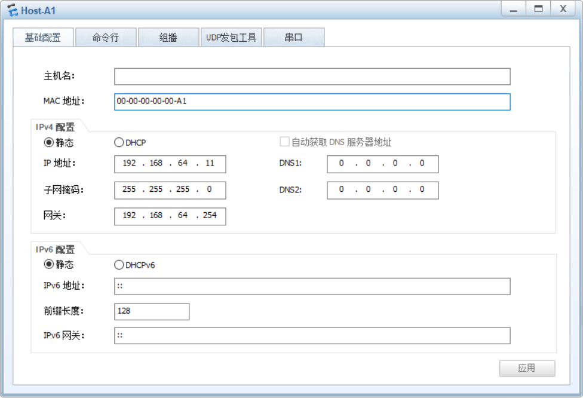
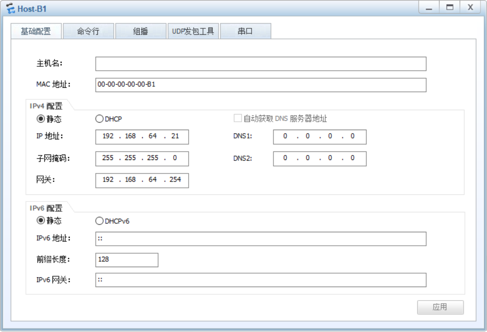

# 任务01 单交换机上应用 VLAN

### SW-1

```
display vlan
display port vlan

```

### 测试连通性

这个地方不指定哪个 IP 了，自行选择

```
ping 192.168.64.11
```

```
ping 192.168.64.12
```

```
ping 192.168.64.21
```

```
ping 192.168.64.22
```

### SW-1

改名、创 VLAN 、配置接口、查看配置、保存

```
system-view
undo info-center enable
sysname SW-1


vlan 10
quit
vlan 20
quit


interface Ethernet 0/0/1
port link-type access
port default vlan 10
quit
interface Ethernet 0/0/2
port link-type access
port default vlan 10
quit
interface Ethernet 0/0/5
port link-type access
port default vlan 20
quit
interface Ethernet 0/0/6
port link-type access
port default vlan 20
quit


display vlan
display port vlan

quit
save
y

```

### 测试连通性

这个地方不指定哪个 IP 了，自行选择

```
ping 192.168.64.11
```

```
ping 192.168.64.12
```

```
ping 192.168.64.21
```

```
ping 192.168.64.22
```

# 任务02 跨交换机应用 VLAN

### 测试连通性

这个地方不指定哪个 IP 了，自行选择

```
ping 192.168.64.11
```

```
ping 192.168.64.12
```

```
ping 192.168.64.21
```

```
ping 192.168.64.22
```

```
ping 192.168.64.13
```

```
ping 192.168.64.14
```

```
ping 192.168.64.23
```

```
ping 192.168.64.24
```

###  SW-1

改名、创 VLAN 、配置接口、查看配置、保存

```
system-view
undo info-center enable
sysname SW-1

vlan batch 10 20

interface Ethernet 0/0/1
port link-type access
port default vlan 10
quit
interface Ethernet 0/0/2
port link-type access
port default vlan 10
quit
interface Ethernet 0/0/5
port link-type access
port default vlan 20
quit
interface Ethernet 0/0/6
port link-type access
port default vlan 20
quit

interface GigabitEthernet 0/0/1
port link-type trunk
port trunk allow-pass vlan 10 20
quit
quit
display port vlan
save
y


```

###  SW-2

改名、创 VLAN 、配置接口、查看配置、保存

```
system-view
undo info-center enable
sysname SW-2

vlan batch 10 20

interface Ethernet 0/0/1
port link-type access
port default vlan 10
quit
interface Ethernet 0/0/2
port link-type access
port default vlan 10
quit
interface Ethernet 0/0/5
port link-type access
port default vlan 20
quit
interface Ethernet 0/0/6
port link-type access
port default vlan 20
quit

interface GigabitEthernet 0/0/1
port link-type trunk
port trunk allow-pass vlan 10 20
quit
quit

display port vlan

save
y


```

### 测试连通性

这个地方不指定哪个 IP 了，自行选择

```
ping 192.168.64.11
```

```
ping 192.168.64.12
```

```
ping 192.168.64.21
```

```
ping 192.168.64.22
```

```
ping 192.168.64.13
```

```
ping 192.168.64.14
```

```
ping 192.168.64.23
```

```
ping 192.168.64.24
```

# 任务03 基于 MAC 地址的 VLAN 应用

###  SW-2

改名、创 VLAN 、配置接口、查看配置、保存

```
system-view
undo info-center enable
sysname SW-2

vlan batch 10 20

interface Ethernet 0/0/1
port link-type access
port default vlan 10
quit
interface Ethernet 0/0/2
port link-type access
port default vlan 20
quit

interface GigabitEthernet 0/0/2
port link-type trunk
port trunk allow-pass vlan 10 20
quit
quit

display port vlan

save
y


```

### SW-3

改名、创 VLAN 、配置接口、查看配置、保存

```
system-view
undo info-center enable
sysname SW-3

vlan batch 10 20

vlan 10
mac-vlan mac-address 0000-0000-00A1
quit
vlan 20
mac-vlan mac-address 0000-0000-00B1
quit

interface GigabitEthernet 0/0/1
mac-vlan enable
port link-type hybrid
port hybrid untagged vlan 10 20
quit
interface GigabitEthernet 0/0/2
port link-type trunk
port trunk allow-pass vlan 10 20
quit
quit

display port vlan

save
y


```

注意，这里我为了适配配置 MAC 地址的命令行，需要将 `Host-A1`、`Host-B1` 的MAC 地址改为 

`00-00-00-00-00-A1`、`00-00-00-00-00-B1` ，如下图所示：





### 测试连通性

这个地方不指定哪个 IP 了，自行选择

```
ping 192.168.64.11
```

```
ping 192.168.64.12
```

```
ping 192.168.64.201
```

```
ping 192.168.64.202
```

# 任务04 VLAN 通信的报文分析

```
ping 192.168.64.24 -t
```

```
ping 192.168.64.13
```


